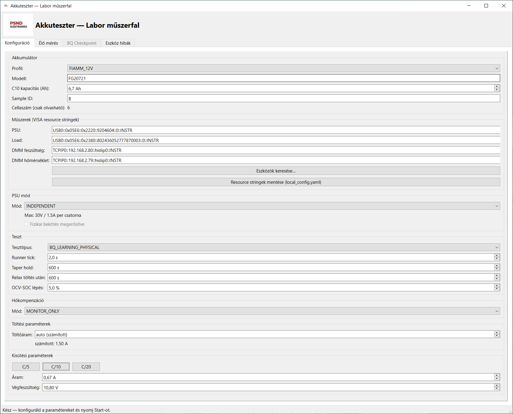
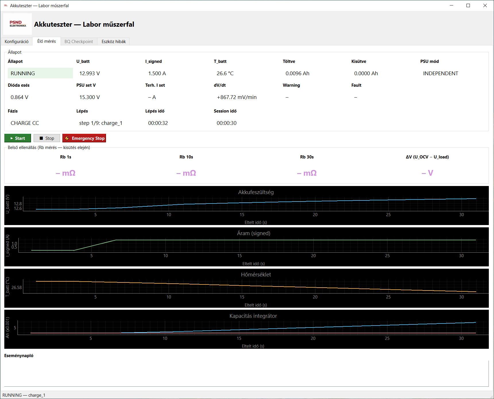
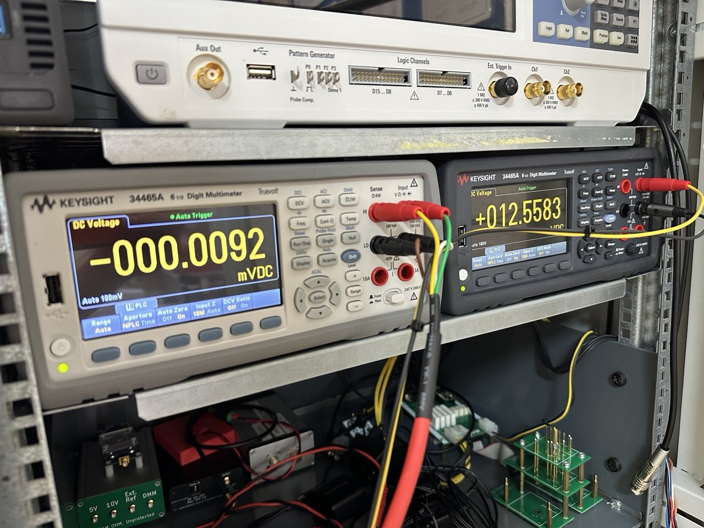
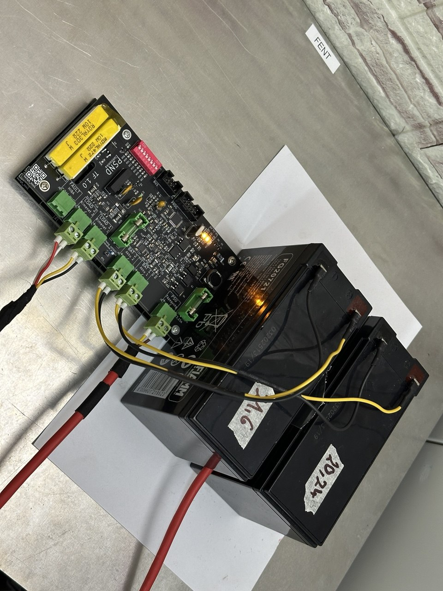
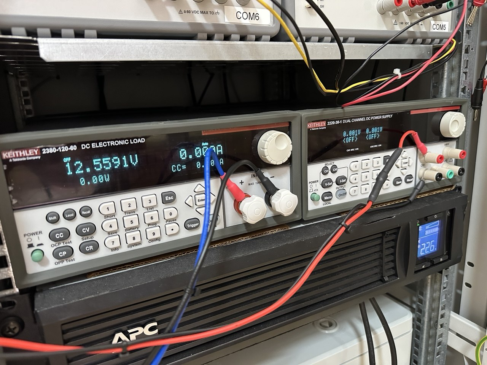
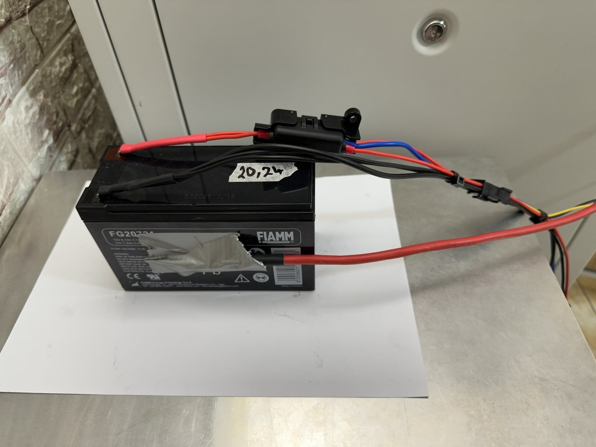

# Akkuparaméter mérés vezérlő

> **⚠️ FEJLESZTÉS ALATT — Work in Progress**
>
> A szoftver aktív fejlesztés és tesztelés alatt áll. Nem minden funkció működik még stabilan. Éles laborhasználat előtt tesztelj mock módban!

AGM/VRLA akkumulátor paraméter mérő és labor vezérlő szoftver.
Fő célja BQ34Z110PWR fuel gauge IC golden image előkészítéséhez szükséges fizikai akkumulátor ciklusok automatizált végrehajtása és dokumentálása.

---

## Képernyőképek

| Program | Program |
|---------|---------|
|  |  |

## Labor fotók

| | | |
|--|--|--|
|  |  |
|  |  |

---

## Hardver

| Műszer | Szerepe | Kapcsolat |
|--------|---------|-----------|
| Keithley 2220-30-1 | Programozható tápegység (töltés) | USB (NI-VISA) |
| Keithley 2380-120-60 | Elektronikus terhelés (kisütés) | USB (NI-VISA) |
| Keysight 34465A | DMM — akkufeszültség mérés | LAN (SCPI) |

A tápegység és az elektronikus terhelés NI-VISA drivert igényel Windows alatt.
A DMM LAN-on, SCPI protokollon keresztül csatlakozik.

---

## Főbb funkciók

| Funkció | Állapot |
|---------|---------|
| Eszközök automatikus keresése (VISA scan) | ✅ Működik |
| DMM-alapú diódaesés-kompenzált töltés (CC/CV) | ✅ Működik |
| Kisütési ciklus elektronikus terheléssel | ✅ Működik |
| Relaxációs várakozás | ✅ Működik |
| OCV-SOC lépcsős mérés | 🔧 Részleges |
| Valós idejű mérés grafikon | ✅ Működik |
| Session log és CSV export | ✅ Működik |
| Checkpoint / folytatás megszakított mérés után | 🔧 Tesztelés alatt |
| BQ34Z110PWR fizikai golden image ciklus | 🔧 Tesztelés alatt |
| Hőmérséklet kompenzáció (második DMM) | 🔧 Részleges |
| Impedancia jellegű mérés | 📋 Tervezett |

---

## Üzemmódok részletesen

A szoftver négy független vezérlő állapotgépből áll, amelyek önállóan vagy sorban is futtathatók.

---

### Töltés — CC/CV DMM-kompenzált

**Cél:** AGM akku teljes feltöltése konstantáram → konstansfeszültség módban, ahol a DMM méri az akkufeszültséget (nem a PSU readback-je).

**Miért kell DMM?** Ha a töltési körben soros dióda vagy kábelellenállás van, a PSU saját feszültség-readbackje a diódaesést (tipikusan 0,3–0,9 V) is tartalmazza — az akku valós feszültsége alacsonyabb. A DMM az akkukapcsain mér, így a PSU feszültsége a tényleges akkufeszültség alapján szabályozódik.

**Állapotok:**

| Állapot | Leírás |
|---------|--------|
| `INIT` → `PRECHECK` | DMM érvényesség, PSU mód, előfeszültség ellenőrzés |
| `PSU_PRESET` | PSU feszültség = célfeszültség + max dióda-esés, áram = profil C-ráta szerint |
| `CHARGE_CC` | Konstantáram fázis — PSU CC módban tart, DMM figyeli az akkufeszültséget |
| `CHARGE_CV_DMM_CONTROL` | DMM visszacsatolásos feszültségszabályozás: PSU feszültségét lépteti (fel max 50 mV/tick, le max 500 mV/tick), deadband ±10 mV |
| `TAPER_HOLD` | 10 perces tartás: taper feltétel — U_batt ≥ célfeszültség és I ≤ taper_I; ha a feltétel megszakad, visszalép CV-be |
| `CHARGE_DONE` | PSU output OFF, ciklus kész |
| `FAULT` | Vészleállítás: terhelés OFF → PSU OFF |

**Lehetséges hibák (`FAULT` okok):**

- `DMM_FEEDBACK_LOST` — DMM nem válaszol
- `BATTERY_OVERVOLTAGE` — akku feszültsége kritikus határt ért el
- `SERIES_DROP_EXCEEDED` — soros esés meghaladta a limitet
- `MAX_CHARGE_TIME_REACHED` — 24h limit
- `MAX_CHARGE_AH_REACHED` — névleges kapacitás 120%-a

---

### Kisütés — CC elektronikus terheléssel

**Cél:** Akkumulátor kapacitásának mérése konstans áramú kisütéssel, közben belső ellenállás (Rb) becslése.

**Állapotok:**

| Állapot | Leírás |
|---------|--------|
| `INIT` → `PRECHECK` | DMM érvényesség, előfeszültség ellenőrzés, PSU biztosan OFF |
| `DISCHARGE_CC_SETUP` | Terhelés CC módba áll, áram = profil C/5, terhelés be |
| `DISCHARGE_CC_RUN` | Kisütés fut; integrátor számolja az eltávolított Ah-t; Rb mérés 1 s / 10 s / 30 s-os időpontokban |
| `DISCHARGE_DONE` | Terminate feszültség elérve (default: 1,80 V/cella), terhelés OFF |
| `FAULT` | Vészleállítás |

**Rb mérés:** Terhelésbekapcsolás előtti OCV és az 1 s / 10 s / 30 s-os feszültség különbségéből számítja az belső ellenállást (Rb = ΔV / I_set), mΩ-ban logolva.

**Lehetséges hibák:**

- `DMM_FEEDBACK_LOST` — DMM kiesés
- `LOAD_COMM_LOST` — terhelés kommunikációs hiba
- `LOAD_POWER_LIMIT_EXCEEDED` — 250 W hardver limit (Keithley 2380 max)
- `MAX_DISCHARGE_TIME_REACHED` / `MAX_DISCHARGE_AH_REACHED`

---

### Relaxáció

**Cél:** Töltés vagy kisütés után az akkumulátor feszültségének stabilizálása nyílt áramkörben (OCV felé közelítés).

**Konfiguráció:**

| Paraméter | Alapérték |
|-----------|-----------|
| Töltés utáni relaxáció | 2 h |
| Kisütés utáni relaxáció | 5 h (kulcspontokon: 100%, 50%, 20%, 10%, 0%) |
| dV/dt korai kilépés | alapból kikapcsolva |

DMM hibánál esemény logolódik, de a relaxáció nem áll le automatikusan — a mérés minőségét `DEGRADED_DMM_LOSS_DURING_RELAX` jelöli.

---

### OCV-SOC lépcsős karakterizáció (🔧 Részleges)

**Cél:** Az akku teljes töltöttségi tartományán (100% → 0%) OCV–SOC görbe és belső ellenállás térkép felvétele, BQ34Z110PWR golden image paraméterekhez.

**Folyamat:**

1. Teljes töltés (belső CC/CV töltővel)
2. 5 h relaxáció 100%-on
3. Ismételt 5%-os kisütési lépések C/10 árammal (20 lépés)
4. Minden lépés után relaxáció, majd OCV mérés + Rb impulzusteszt

**Állapotok:**

| Állapot | Leírás |
|---------|--------|
| `PRECHARGE` | Belső ChargeController fut — teljes töltés |
| `PRECHARGE_RELAX` | 5 h várakozás 100%-on |
| `STEP_DISCHARGE` | Részleges kisütés (C/10) a következő SOC lépcsőig |
| `STEP_RELAX` | Relaxáció: kulcspontokon 5 h, többi lépésnél 2 h |
| `IMPULSE_PREP` | OCV mérés a relax végén |
| `IMPULSE_ON` → `IMPULSE_WAIT_1S/10S/30S` | C/5 impulzus, Rb mérés 1 s / 10 s / 30 s-ban |
| `LOG_SOC_POINT` | Adatpont rögzítése: SOC%, OCV [V], Rb_1s/10s/30s [Ω], hőmérséklet [°C] |
| `DONE` | 0% SOC elérve, mérés kész |

**Kulcspontok** (5 h relaxáció): 100%, 50%, 20%, 10%, 0%
**Többi lépés**: 2 h relaxáció

**Kimenet CSV-ben:** soc_percent, removed_Ah_total, ocv_V, rb_1s_ohm, rb_10s_ohm, rb_30s_ohm, temperature_C, measurement_quality

---

## Biztonság

A szoftver safety-first elvek szerint épül fel:

- Hiba esetén: elektronikus terhelés OFF → tápegység output OFF
- DMM feedback elvesztése esetén töltés azonnal megáll
- Minden esemény logolva van

---

## Telepítés és első futtatás

Részletes leírás: **[INSTALL.md](INSTALL.md)**

Rövid összefoglaló:
1. Telepítsd az **NI-VISA** drivert (kötelező az USB műszerekhez)
2. Indítsd újra a PC-t
3. Futtasd az `akkuteszter.exe`-t (első indításkor létrehozza a `local_config.yaml`-t)
4. **Konfiguráció → "Eszközök keresése…"** — azonosítsd a VISA resource stringeket
5. Írd be a stringeket a `local_config.yaml`-ba
6. Indítsd újra

### Futtatás forráskódból

```bash
pip install -r requirements.txt
python Prog/main.py
```

### EXE build (PyInstaller)

```bash
pip install pyinstaller
pyinstaller akkuteszter.spec
# Kimenet: dist/akkuteszter/akkuteszter.exe
```

---

## Tesztek futtatása

```bash
python -m pytest
```

Statikus ellenőrzések:

```bash
python -m ruff check Prog
python -m mypy Prog
```

A tesztek mock driverekkel futnak, fizikai műszer nem szükséges.

---

## Akkumulátor profilok

A `Prog/config/battery_profiles/` mappában YAML formátumú profilok találhatók:

- `FIAMM_12V.yaml` — FIAMM 12V AGM/VRLA
- `FIAMM_24V.yaml` — FIAMM 24V AGM/VRLA

---

## Projekt struktúra

```
Prog/
├── main.py                  # Belépési pont
├── drivers/                 # Műszer driverek (PSU, Load, DMM)
├── src/                     # Üzleti logika (töltés, kisütés, OCV, relax)
├── gui/                     # PySide6 GUI
├── config/                  # Alapértelmezett konfig, battery profilok
├── tests/                   # Pytest tesztek (mock driverekkel)
└── tools/                   # Segédeszközök (VISA kapcsolat teszt)
akkuteszter.spec             # PyInstaller build leírás
requirements.txt             # Python függőségek
INSTALL.md                   # Részletes telepítési útmutató
```

---

## Licenc

[MIT](LICENSE) — Copyright (c) 2026 kvez
